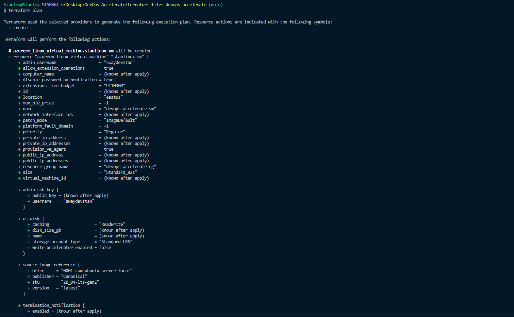
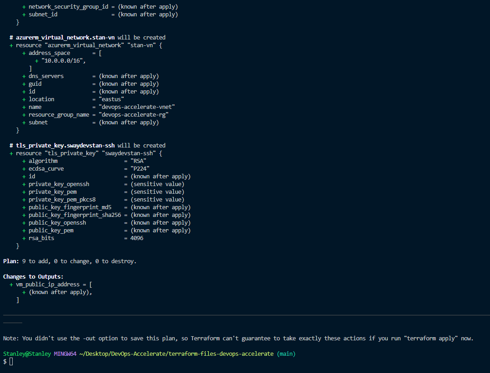
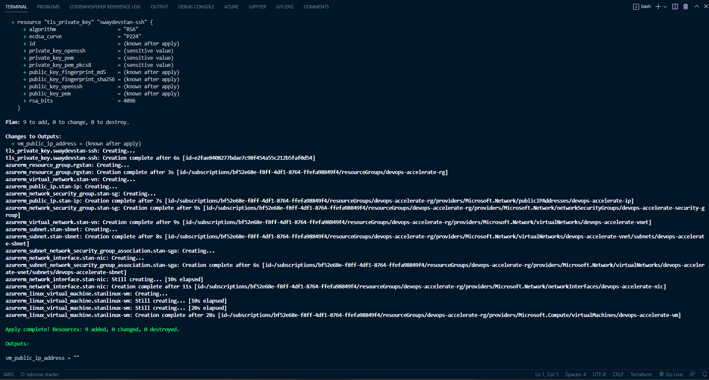
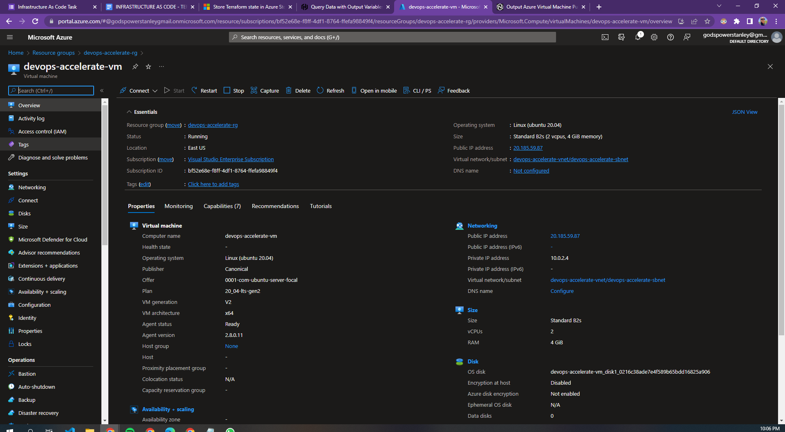
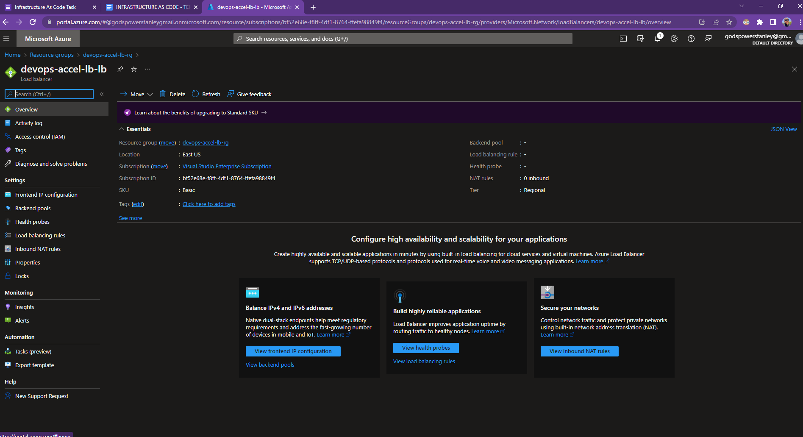

# Terraform manifests to deploy Azure resources
> Terraform manifests to deploy a load balancer, single VM instance and virtual machine scale sets to Azure

This repository conatins solutions to DevOps Accelerate Infrastructure as code. Resources created as required are shown below:

* Images showing Terraform plan output for single VM Instance
  
  

* Image showing Terraform plan output for single VM Instance
  

* Image showing running single VM Instance
  

* Image showing deployed loadbalancer 
  

### Use command below to deploy resources to your Azure Cloud Environment
- `terraform init` - To initialize the working directory and pull down the provider
- `terraform plan` - To go through a "check" and confirm the configurations are valid
- `terraform apply` - To create the resource